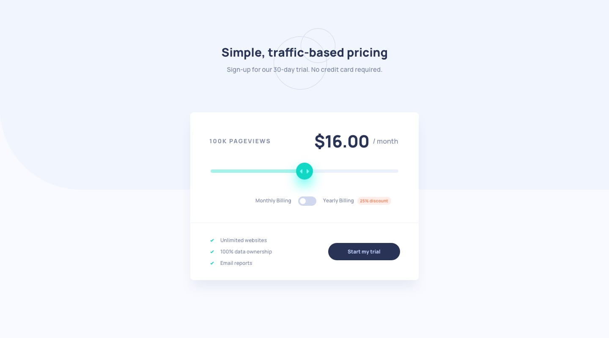

# Frontend Mentor - Interactive Pricing Component

<div align="center">

### 🔗 [**VER O SITE AO VIVO →**](https://anaclarissi.github.io/interactive-pricing-component/)

</div>


## 📋 Índice

- [Visão geral](#visão-geral)
  - [O desafio](#o-desafio)
  - [Screenshots](#screenshots)
  - [Links](#links)
- [Meu processo](#meu-processo)
  - [Construído com](#construído-com)
  - [O que aprendi](#o-que-aprendi)
  - [Continuando o desenvolvimento](#continuando-o-desenvolvimento)
- [Autor](#autor)

## Visão geral

### O desafio

Os usuários devem ser capazes de:

- ✅ Visualizar o layout ideal do app de acordo com o tamanho da tela do dispositivo
- ✅ Ver os estados de hover de todos os elementos interativos da página
- ✅ Usar o slider e o toggle para ver os preços de diferentes números de pageviews

### Screenshots

**Desktop**



**Mobile**


### Links

- 🎯 Desafio original: [Frontend Mentor - Interactive pricing component](https://www.frontendmentor.io/challenges/interactive-pricing-component-t0m8PIyY8)
- 🔗 Repositório de solução: [github.com/anaClarissi/interactive-pricing-component](https://github.com/anaClarissi/interactive-pricing-component)
- 🌐 Site ao vivo: [anaclarissi.github.io/interactive-pricing-component](https://anaclarissi.github.io/interactive-pricing-component/)

## Meu processo

### Construído com

- HTML5 semântico
- CSS3 (Grid e Flexbox)
- Mobile-first workflow
- JavaScript (Vanilla)
- Acessibilidade (`:focus-visible`, `aria-labelledby`, `prefers-reduced-motion`)

### O que aprendi

Este desafio trouxe boas oportunidades de aprofundar CSS Grid combinado com media queries e de revisitar acessibilidade de componentes customizados.

Um dos pontos mais interessantes foi reorganizar o layout do card entre mobile e desktop usando `grid-template-columns` e `grid-template-rows`, posicionando cada elemento explicitamente via `grid-column` e `grid-row`:

```css
@media (min-width: 60em) {
  .card-body {
    grid-template-columns: repeat(2, 1fr);
    grid-template-rows: repeat(3, 1fr);
  }

  #page-range {
    grid-column: 1 / span 2;
    grid-row: 2 / span 1;
  }

  .billing-content {
    grid-column: 1 / span 2;
    grid-row: 3 / span 1;
  }
}
```

Também dei atenção especial à acessibilidade do toggle de billing, que originalmente não tinha nenhuma descrição para leitores de tela. Resolvi isso associando o input aos textos visuais já existentes via `aria-labelledby`, evitando duplicar conteúdo:

```html
<p id="monthly-billing">Monthly Billing</p>

<label class="switch">
  <input
    type="checkbox"
    id="switch-billing"
    aria-labelledby="monthly-billing yearly-billing"
  />
  <span class="slider"></span>
</label>

<p id="yearly-billing">Yearly Billing <span class="discount">-25% discount</span></p>
```

E para o estado de foco por teclado, usei `:focus-visible` no input em vez de `:focus`, garantindo que o destaque visual apareça apenas na navegação por teclado, sem interferir no clique do mouse:

```css
.switch:hover .slider,
#switch-billing:focus-visible + .slider {
  background-color: var(--green-400);
}
```

Por fim, respeitei a preferência de movimento reduzido do usuário, envolvendo todas as transições numa media query dedicada:

```css
@media (prefers-reduced-motion: no-preference) {
  #page-range::-webkit-slider-thumb {
    transition: all 0.2s ease-in-out;
  }

  .slider {
    transition: transform 0.2s ease, background-color 0.2s ease-in-out;
  }

  .start-btn {
    transition: color 0.2s ease-in-out;
  }
}
```

### Continuando o desenvolvimento

Para próximos projetos, quero:

- Adicionar suporte a `::-moz-range-thumb` para estilizar o slider corretamente também no Firefox
- Explorar mais estados de foco visível em inputs nativos sem depender apenas de remover o `outline` padrão
- Praticar mais composições de layout com CSS Grid em vez de Flexbox como primeira escolha

## Autor

<div align="center">

[](https://www.frontendmentor.io/profile/anaClarissi)
[](https://www.linkedin.com/in/anaclarissi)

</div>